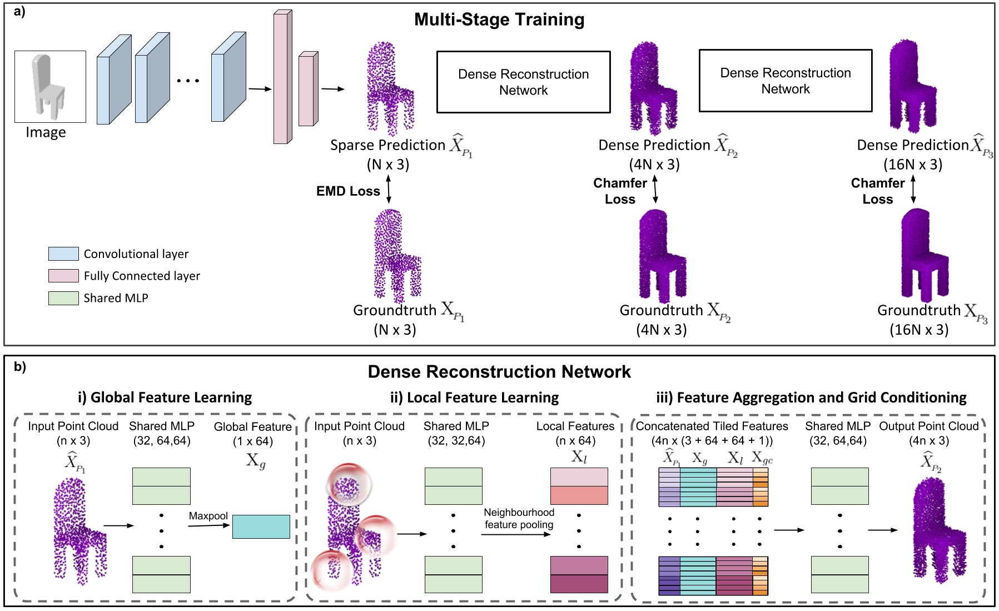
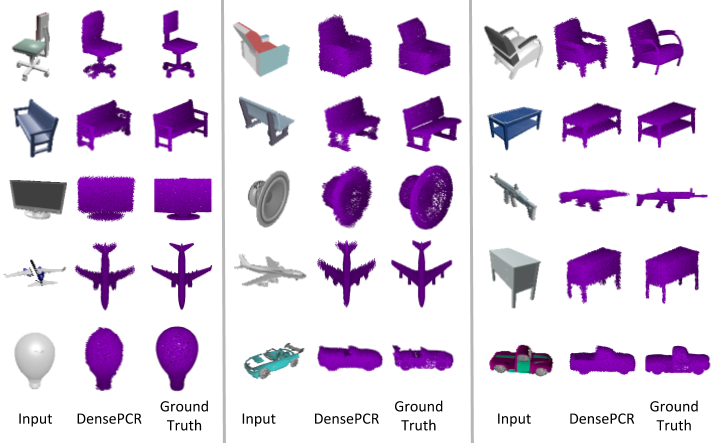

# DensePCR
This repository contains the source codes for the paper [Dense 3D Point Cloud Reconstruction Using a Deep Pyramid Network](http://val.serc.iisc.ernet.in/valweb/papers/WACV19_Dense_PCR.pdf).</br>
Accepted at *Winter Conference on Applications of Computer Vision (WACV 2019)*

## Citing this work
If you find this work useful in your research, please consider citing:
```
@inproceedings{mandikal20183dpsrnet,
 author = {Mandikal, Priyanka and Babu, R Venkatesh},
 booktitle = {Winter Conference on Applications of Computer Vision ({WACV})},
 title = {Dense 3D Point Cloud Reconstruction Using a Deep Pyramid Network},
 year = {2019}
}
```

## Overview
We propose a scalable and light-weight architecture for predicting high-resolution 3D point clouds from single-view images. Existing point-cloud based reconstruction approaches directly predict the entire point cloud in a single stage. Although this technique can handle low resolution point clouds, it is not a viable solution for generating dense, high-resolution outputs. In this work, we introduce DensePCR, a deep pyramidal network for point cloud reconstruction that hierarchically predicts point clouds of increasing resolution. Towards this end, we propose an architecture that first predicts a low-resolution point cloud, and then hierarchically increases the resolution by aggregating local and global point features to condition them on a coordinate grid. This technique generates high-resolution outputs of improved quality in comparison to single stage reconstruction networks, while also providing a light-weight and scalable architecture.


## Sample Results
Below are a few sample reconstructions from our trained model. The predictions are dense outputs containing 16,384 points.



